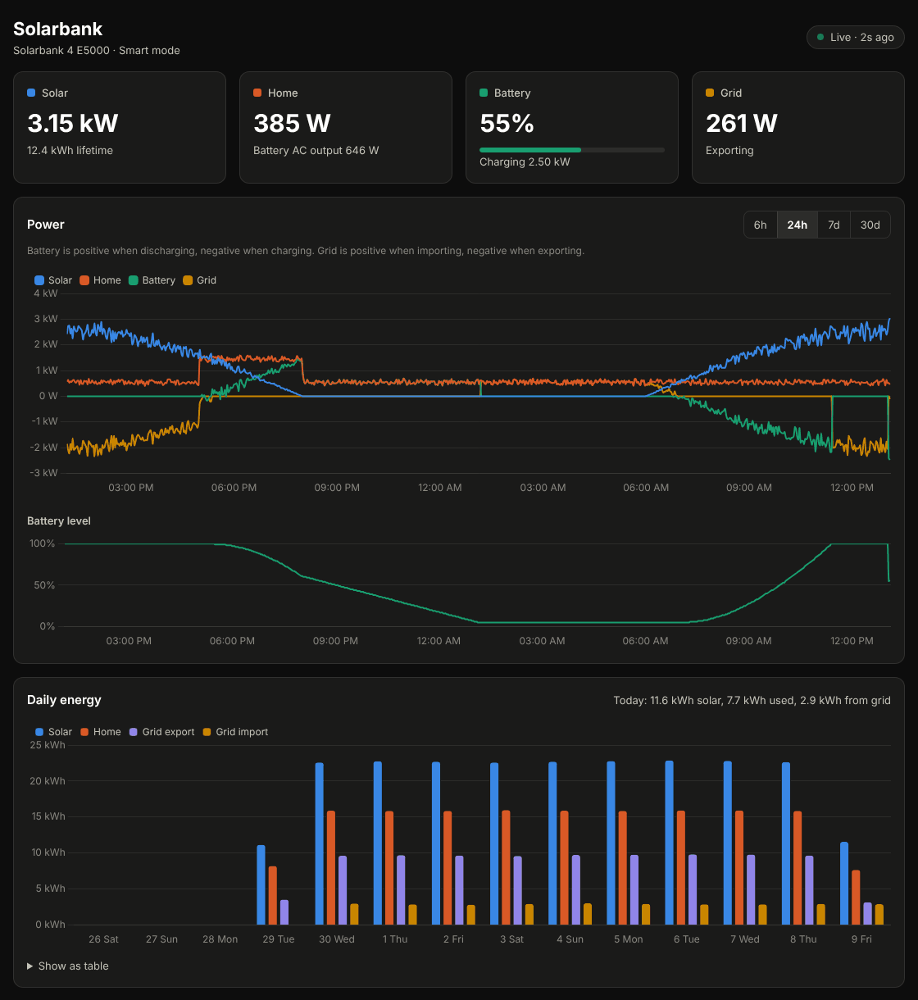

# Anker E5000 Dashboard

A self-hosted dashboard for the **Anker SOLIX Solarbank 4 E5000**, with optional **Anker Smart Meter Gen 2** support. It runs as one Docker container and reads both devices directly on your network, so you don't need Home Assistant or an Anker cloud login. It only ever reads and never changes any settings.

You get live solar, home, battery and grid power, power history, daily energy totals and device details. The container keeps a year of history.

## Setup

**1. Turn on Modbus in the Anker app.** For each device (the Solarbank, and the Smart Meter if you have one), open it in the app, tap the gear icon, then **Three-Party Control Settings**. Turn on **Modbus TCP**, and note the IP address it shows. It helps to give each device a fixed IP in your router.

**2. Deploy the stack in Portainer.** Go to **Stacks › Add stack › Repository**, enter this repo's URL, and deploy. Turn on **Authentication** with your GitHub username and token, since the repo is private. The Compose path is `docker-compose.yml`.

**3. Open the dashboard** at `http://<your-pi-or-nas>:8080` and enter the Solarbank's IP address. To add a Smart Meter, click the gear icon (top right) and choose **Smart Meter**.

The image is private too. To let Portainer pull it, add a registry under **Registries › Add registry › Custom**. Use `ghcr.io`, your GitHub username, and a [token](https://github.com/settings/tokens) with `read:packages`.

## If something goes wrong

| Problem | Fix |
|---|---|
| "Port is already allocated" when deploying | Add the stack environment variable `HOST_PORT` = `8090` (or any free port), and open that port instead |
| Setup says **no network route** | Set the stack's Compose path to `docker-compose.host.yml`, which uses host networking |
| Setup says **port 502 is closed** | Modbus TCP is off in the Anker app |
| Setup says **no answer** | The IP is wrong, or the device is offline |

## Settings

You don't need to edit the compose file. Set any of these as **Environment variables** on the Portainer stack.

| Variable | Default | What it does |
|---|---|---|
| `HOST_PORT` | `8080` | Port you open the dashboard on |
| `TZ` | `Europe/London` | Timezone for daily totals |
| `RETENTION_DAYS` | `365` | Days of history to keep (`0` keeps everything) |
| `POLL_SECONDS` | `5` | How often to read the devices |
| `SOLARBANK_HOST`, `METER_HOST` | – | Set an address here instead of on the setup screen. The setup screen then shows it read-only |
| `OCTOPUS_API_KEY`, `OCTOPUS_ACCOUNT` | – | Your Octopus Energy API key and account number, instead of entering them with **Connect Octopus** on the dashboard |
| `PORT` | `8080` | Port inside the container. Only needed with `docker-compose.host.yml` |
| `RELAY_METER` | `false` | `true` shares the Smart Meter with Home Assistant (see below) |
| `RELAY_HOST_PORT` | `502` | Port the Smart Meter relay is published on |

`SOLARBANK_PORT`, `SOLARBANK_UNIT_ID`, `METER_PORT`, `METER_UNIT_ID` and `LOG_LEVEL` also exist, but you'll rarely need them.

## Octopus Energy

**Connect Octopus** on the dashboard (or the variables above) reads your tariff from your account: Agile, Go, Intelligent Go, Cosy, Flux, Tracker and fixed tariffs, plus your export tariff. It's read-only and never changes your account or the battery.

- The battery payback then uses the price of each half hour you actually paid, including Agile's changing prices and Intelligent Go's extra smart-charge slots, so you only need to enter what the battery cost.
- **Electricity prices** shows the upcoming prices and suggests when charging the battery from the grid is worth it, when to run the house from the battery, and the best export times.
- Find your API key on octopus.energy under **Account > Personal details > API access**. It's stored in the data volume (`settings.json`), readable only inside the container.
## Using the Smart Meter in Home Assistant too

The Smart Meter accepts only one Modbus TCP connection at a time, so the dashboard and Home Assistant can't both connect to it. The relay fixes that: the dashboard keeps the meter's one connection and answers Home Assistant with the same registers, on port 502, as if it were the meter.

1. In Home Assistant, delete the Smart Meter from Anker's integration (Settings > Devices & services), so it lets go of the meter.
2. Add the stack environment variable `RELAY_METER` = `true` and redeploy. The logs say "Relaying the Smart Meter read-only on Modbus TCP port 5020" (502 outside the container).
3. In Home Assistant, add the Anker SOLIX integration again and enter **this host's IP address** instead of the meter's. It's recognised as the Smart Meter.

The relay is read-only: it never sends anything to the meter, and Home Assistant gets an error if it tries to change a setting. If the dashboard loses the meter, Home Assistant shows it unavailable until the dashboard reconnects. Its readings are as fresh as the dashboard's last poll (`POLL_SECONDS`). Use the normal `docker-compose.yml` for this; with `docker-compose.host.yml` the relay can only listen on `RELAY_PORT` (5020), which Home Assistant's add screen doesn't accept. The Solarbank itself accepts several connections, so it doesn't need a relay.

## More

- **Export:** the Export data card at the bottom of the dashboard downloads readings as CSV or JSON for any date range, or a full backup of the database. Smart Meter readings are recorded from this version on.
- **Try it without hardware:** `docker compose -f docker-compose.demo.yml up --build` runs simulated devices.
- **API:** `/api/live`, `/api/history?hours=24`, `/api/energy?days=14`, `/api/payback`, `/api/runtime` (when the battery is expected to reach its discharge limit or be full), `/api/export?data=minutes&start=2026-01-01&end=2026-01-31` (also `daily`, `meter`, `slots`; add `&format=json` for JSON), `/api/export/backup` (the whole SQLite database), `/api/raw` (every register, for troubleshooting) and `/healthz`.
- **Development:** `pip install -r requirements-dev.txt && python -m pytest`, then `python -m simulator.sim --meter-port 5021` and `python -m app`.
- The register maps come from Anker's MIT-licensed [official Home Assistant integration](https://github.com/anker-charging/ha-anker-solix-official). See [NOTICE.md](NOTICE.md).
